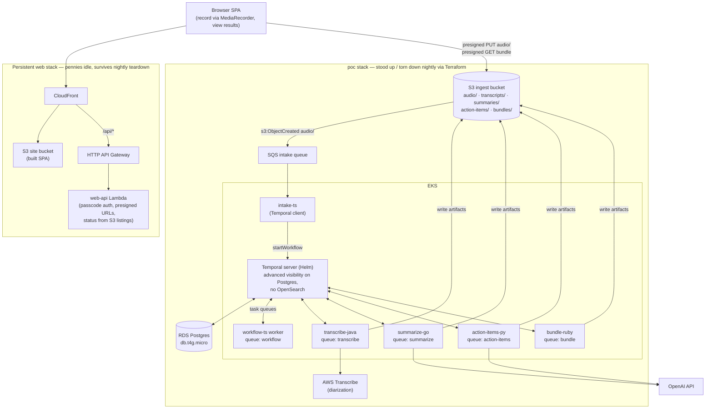

# audio-recording-processor

A learning-focused POC that orchestrates a **polyglot** audio-processing pipeline with
[Temporal](https://temporal.io) on **self-hosted EKS**. An audio file lands in S3 and a
Temporal workflow drives a chain of single-purpose activities — each deliberately written
in a different language:

| Step | Language | Does | AWS service |
|------|----------|------|-------------|
| Workflow definition | TypeScript | orchestrates the activities | — |
| Transcribe | Java | audio → transcript (with speaker diarization) | AWS Transcribe |
| Summarize | Go | transcript → summary | OpenAI |
| Action items | Python | transcript → action items | OpenAI |
| Bundle | Ruby | transcript+summary+actions → one combined S3 doc | — |
| Intake | TypeScript | S3 upload → starts the workflow | SQS |

Everything in AWS is **Terraform**. The whole stack is meant to be stood up and torn
down cheaply.

> Status: under construction. See `../.claude/plans/` for the build plan and the phase
> checklist below.

## Architecture



Activities pass **S3 keys**, not payloads, to stay under Temporal's message-size
limits. Results are consumed from S3 by the [web app](#web-app-phase-7).

## Prerequisites

Install locally (macOS):

```bash
brew install terraform awscli kubernetes-cli helm gettext
brew install --cask docker      # or: brew install colima docker  (lighter)
aws configure                   # credentials + default region us-east-1
```

Runtimes for building the workers (already present on the dev machine): Node, Java+Maven,
Go, Python 3, Ruby+Bundler.

**One-time AWS console steps** (not doable in Terraform):
- **OpenAI API key** — the summarize (Go) and action-items (Python) workers call OpenAI.
  The key lives in Secrets Manager as `arp/openai-api-key`. It has already been created
  for this account, so Terraform must **adopt** it on first apply rather than recreate:
  ```bash
  terraform import aws_secretsmanager_secret.openai arp/openai-api-key
  # rotate the value anytime with:
  aws secretsmanager put-secret-value --secret-id arp/openai-api-key \
    --secret-string 'sk-...' --region us-east-1
  ```
  In-cluster the workers read it via IRSA (`OPENAI_SECRET_ID`); locally you can just
  export `OPENAI_API_KEY`. Model is env-configurable (`OPENAI_MODEL`, default
  `gpt-4o-mini`). Verified end-to-end via `go test -run TestSummarizeLive` in
  `services/summarize-go`.
  > Why not Bedrock: on this brand-new account, both Anthropic and Nova on-demand Bedrock
  > quotas are **0 tokens/day and non-adjustable** — an account-provisioning hold that
  > isn't self-serve fixable. Once AWS lifts it, Bedrock is a drop-in alternative.

## Layout

```
infra/terraform/
  bootstrap/   # creates the S3 remote-state bucket (run once, local state)
  poc/         # the actual stack: VPC, EKS, RDS, ECR, Temporal, workers
  web/         # persistent web app stack: CloudFront + S3 site, API GW + Lambda
k8s/           # Helm values + worker manifests
services/      # one directory per worker (workflow-ts, transcribe-java, ...)
```

## Bring-up

```bash
# 1. Create the remote-state bucket (once).
cd infra/terraform/bootstrap
terraform init && terraform apply
#   -> note the state_bucket_name output; if you changed it, update ../poc/backend.tf

# 2. Stand up the stack.
cd ../poc
terraform init
terraform apply
#   -> writes kubeconfig access; then:
aws eks update-kubeconfig --name arp --region us-east-1
kubectl get nodes            # should show the managed node group, Ready
```

Terraform stops at the AWS layer. The in-cluster pieces are deployed separately:
the Temporal server via the helm CLI ([Temporal server](#temporal-server-phase-2))
and the workers via `./k8s/apply.sh` ([Deploying a worker](#deploying-a-worker-phase-4)).

## Teardown

```bash
cd infra/terraform/poc
terraform destroy

# The web app stack (infra/terraform/web) is intentionally PERSISTENT — it costs
# pennies idle and keeps a stable CloudFront URL across nightly poc teardowns.
# Destroy it (and then the state bucket) only when you're completely done:
cd ../web
terraform destroy
cd ../bootstrap
terraform destroy
```

**Verify nothing billable lingers** (Terraform can't always catch controller-created
resources): check the console for stray **Load Balancers**, **NAT gateways / EIPs**,
**EBS volumes**, and **ECR images**.

## Cost watch-list (~monthly, us-east-1, POC scale)

| Item | Approx |
|------|--------|
| EKS control plane | ~$73 |
| 2× t3.medium nodes | ~$60 |
| RDS db.t4g.micro | ~$12 |
| **NAT gateway (single)** | **~$32** ← biggest avoidable |
| ECR / S3 / SQS / Lambda / Transcribe / OpenAI | pennies at POC volume |
| Web app stack (CloudFront + S3 + API GW + Lambda) | pennies idle — left standing |

## Temporal server (Phase 2)

Deployed with the `temporalio/temporal` Helm chart (1.5.0 / Temporal 1.31.1),
configured for external RDS Postgres and SQL visibility (advanced visibility on
Postgres 12+, so **no OpenSearch**). Values: [k8s/temporal-values.yaml](k8s/temporal-values.yaml).

```bash
# namespace + DB password secret (password pulled from Secrets Manager)
kubectl create namespace temporal
PW=$(aws secretsmanager get-secret-value --secret-id arp/temporal-db \
  --query SecretString --output text | python3 -c "import sys,json;print(json.load(sys.stdin)['password'])")
kubectl create secret generic temporal-db -n temporal --from-literal=password="$PW"

helm repo add temporalio https://go.temporal.io/helm-charts && helm repo update
helm install temporal temporalio/temporal -n temporal --version 1.5.0 \
  -f k8s/temporal-values.yaml --timeout 6m

# register the app namespace the workers use
kubectl exec -n temporal deploy/temporal-admintools -- \
  temporal operator namespace create --address temporal-frontend:7233 --retention 72h default
```

- **RDS requires SSL** (`rds.force_ssl=1`), so each datastore sets `tls.enabled: true`
  with `enableHostVerification: false` (encrypt without shipping the RDS CA). Without
  this the schema-setup hook fails with `no pg_hba.conf entry ... no encryption`.
- The `connectAddr` in the values file is the RDS endpoint from `terraform output`; update
  it if the DB is recreated.
- **Web UI** is internal (ClusterIP `temporal-web:8080`), nothing is exposed publicly.
  Reach it with a port-forward:
  ```bash
  kubectl port-forward -n temporal svc/temporal-web 8233:8080
  ```
  Then open http://localhost:8233 — workflow runs are under the `default` namespace:
  http://localhost:8233/namespaces/default/workflows. Each `processAudio` run shows the
  activity timeline (`transcribeAudio → summarizeTranscript ∥ extractActionItems`), the
  protobuf payloads at each step, and any retries. Note the UI is not
  read-only — you can terminate/signal workflows from it.

  `kubectl port-forward` drops the streamed connection on idle (`error: lost connection to
  pod`); wrap it to auto-reconnect if you want it to stay up:
  ```bash
  while true; do kubectl port-forward -n temporal svc/temporal-web 8233:8080; sleep 1; done
  ```

## Deploying a worker (Phase 4)

Each worker follows the same path — build an image, push to its ECR repo, apply a
Deployment whose ServiceAccount is IRSA-bound to a least-privilege role. The
summarize (Go) worker is the reference:

```bash
ECR=$(terraform -chdir=infra/terraform/poc output -raw account_id).dkr.ecr.us-east-1.amazonaws.com
aws ecr get-login-password --region us-east-1 | docker login --username AWS --password-stdin $ECR
# IMPORTANT: nodes are amd64; build for that platform or the pod crashes (exec format error)
docker build --platform linux/amd64 -t $ECR/arp/summarize-go:latest services/summarize-go
docker push $ECR/arp/summarize-go:latest
```

The manifests live in `k8s/workers/*.yaml.tmpl` (templates, so no AWS account ID
is committed). Render and apply them all — namespace first — with:

```bash
./k8s/apply.sh
```

`apply.sh` fills `${AWS_ACCOUNT_ID}` / `${AWS_REGION}` from `terraform output`
(the single source of truth), or from a gitignored `k8s/config.env` if you'd
rather not hit Terraform (copy `k8s/config.env.example`). Requires `envsubst`
(`brew install gettext`).

> The `account_id` output only lands in Terraform state after a `terraform
> apply` runs (adding an output doesn't update state on its own). Until then
> `apply.sh`'s default path fails with `Output "account_id" not found` — run
> `terraform -chdir=infra/terraform/poc apply` once (an outputs-only change, no
> infra touched), or use `k8s/config.env`.

- Workers run in the `arp` namespace and reach Temporal at
  `temporal-frontend.temporal.svc:7233` (cross-namespace, frontend stays internal).
- IRSA roles live in [infra/terraform/poc/irsa.tf](infra/terraform/poc/irsa.tf); the SA
  annotation's role ARN must match, and the role's trust policy pins the exact
  `namespace:serviceaccount`.
- Verify a worker is polling: `kubectl exec -n temporal deploy/temporal-admintools --
  temporal task-queue describe --address temporal-frontend:7233 -n default --task-queue summarize`.

## Shared S3 schemas (protobuf)

Every S3 artifact the pipeline produces is defined once in [proto/](proto/) and stored as
**proto-JSON** (proto3's canonical JSON mapping) — human-readable files, single source of
truth for each shape, generated per-language:

| Artifact | proto | Writer | Readers |
|----------|-------|--------|---------|
| transcript | `transcript.proto` | Java | Go, Python, Ruby, web app |
| summary | `summary.proto` | Go | Ruby, web app |
| action items | `action_items.proto` | Python | Ruby, web app |
| bundle | `bundle.proto` (imports the three above) | Ruby | web app |

(The web app reads the proto-JSON directly — no codegen needed.)

Writers use "always print fields" and readers ignore unknown fields so the languages agree
byte-for-byte. (`transcribe-raw/` objects are AWS Transcribe's own output, not ours.)

Generated code is committed (builds don't need `protoc`). Regenerate after editing the
proto:

```bash
brew install protobuf
go install google.golang.org/protobuf/cmd/protoc-gen-go@latest
bash proto/gen.sh
```

The **Temporal-payload DTOs** (the workflow input + every activity's args/results) are
also protobuf, defined in [proto/dtos.proto](proto/dtos.proto). Backend workers
(Java/Go/Python) use their SDK's built-in protobuf payload converter; `workflow-ts`
and `intake-ts` use a custom converter (`DefaultPayloadConverterWithProtobufs` over a
protobufjs json-module root, with `bundlerOptions.ignoreModules: ['fs']` for the workflow
sandbox). So every payload the pipeline moves — S3 files and Temporal payloads alike — is
protobuf-defined.

## Web app (Phase 7)

Record audio in the browser (phone or desktop) and watch the pipeline results
appear. Lives in its own **persistent** Terraform stack
([infra/terraform/web](infra/terraform/web)) so the URL stays stable while the
poc stack is torn down nightly; idle cost is pennies (CloudFront + S3 + HTTP API
+ Lambda).

```
browser (MediaRecorder) ─▶ CloudFront ──▶ S3 site bucket (static SPA)
                              └─ /api/* ─▶ HTTP API GW ─▶ web-api Lambda (TS)
                                                             │ presigned URLs
                                                             ▼
   upload PUT / artifact GETs go straight to s3://arp-ingest-<acct>
   (audio/ upload ──▶ Phase 5 path: SQS → intake → workflow)
```

- API Lambda source: [services/web-api-ts](services/web-api-ts). Two routes:
  `POST /api/recordings` (mint a presigned upload URL) and `GET /api/recordings`
  (list `audio/` objects, presign each one's `bundles/<name>.bundle.json` once it
  exists — the one document the UI fetches; `transcripts/` is listed only to
  distinguish the transcribing vs. summarizing status).
- Auth is a shared passcode (header `x-arp-passcode`) checked against the
  `arp/web-passcode` secret — set its value out-of-band like the OpenAI key:
  `aws secretsmanager put-secret-value --secret-id arp/web-passcode --secret-string '<passcode>'`.
  Presigned URLs are the actual S3 access control. The Lambda caches the value for
  5 minutes, so a rotation takes up to that long to take effect.
- The ingest bucket gets a CORS rule ([poc/s3.tf](infra/terraform/poc/s3.tf)) so the
  browser can PUT/GET against presigned URLs.
- Uploads while the poc stack is down still land nowhere (the bucket is destroyed
  with the stack); the API reports `pipelineDown` so the UI can say so. The S3→SQS
  notification means anything uploaded right after `terraform apply` is processed
  once the workers are up.

```bash
# Bring-up (rarely needed — the stack persists):
./services/web-api-ts/build.sh          # bundle the Lambda first
cd infra/terraform/web
terraform init && terraform apply
#   -> web_url output is the app; set the passcode secret (above) once.
```

The SPA ([services/web-app](services/web-app), React + Vite) records via
MediaRecorder (Safari → AAC/mp4, Chrome → webm/opus — both Transcribe-friendly),
uploads through the presigned PUT, and polls the list every 5s while anything is
still processing. Deploy it (build → sync to the site bucket → invalidate
CloudFront):

```bash
./services/web-app/deploy.sh
```

Local dev proxies /api to the deployed stack:

```bash
cd services/web-app
ARP_WEB_ORIGIN=$(terraform -chdir=../../infra/terraform/web output -raw web_url) npm run dev
```

## Build phases

- [x] **0** — Scaffolding & Terraform remote state
- [x] **1** — Core AWS infra (VPC, EKS, RDS, ECR)
- [x] **2** — Temporal server via Helm (external RDS, no OpenSearch)
- [x] **3** — TS workflow worker + stub activities (prove routing)
- [x] **4** — Polyglot activity workers (Java, Go, Python) — deployed; full pipeline verified end-to-end (audio → transcript → summary + action items)
- [x] **5** — Automatic S3 intake (upload → S3 event → SQS → intake-ts starts the workflow) — verified end-to-end
- [x] ~~**6** — SES inbound email~~ — built, verified, then **removed** along with the Ruby email worker once the web app (Phase 7) covered intake and results; see PR history if you want it back.
- [x] **7** — Web app: **7a** persistent infra + API (CloudFront/S3 site, API GW + Lambda presigning ingest-bucket URLs); **7b** React SPA (record via MediaRecorder → upload → poll results). Verified end-to-end, including two-speaker diarization.
- [x] **8** — Ruby bundle worker (`bundleResults` on queue `bundle`): combines transcript + summary + action items into one `bundles/<name>.bundle.json` (proto `Bundle` embedding the three messages). Ruby rejoins the polyglot roster; verified end-to-end. The web app now reads the bundle as its single per-recording document.
